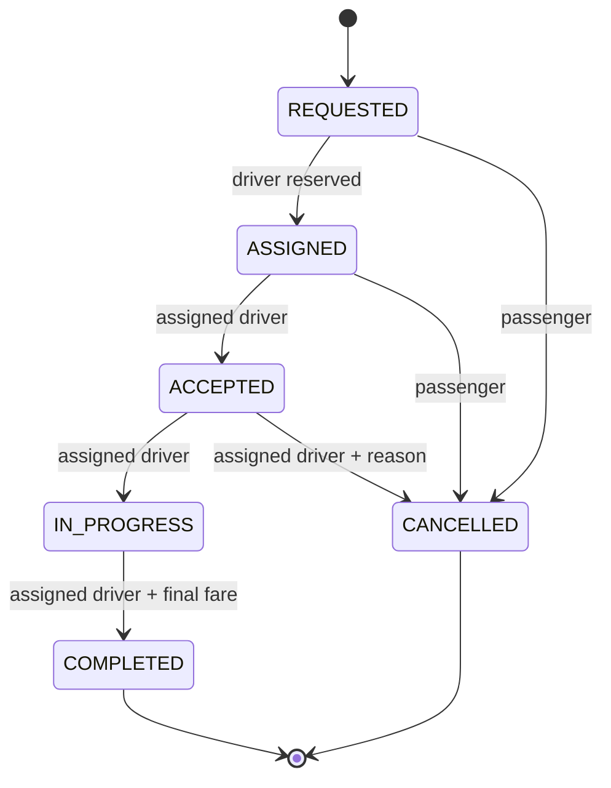
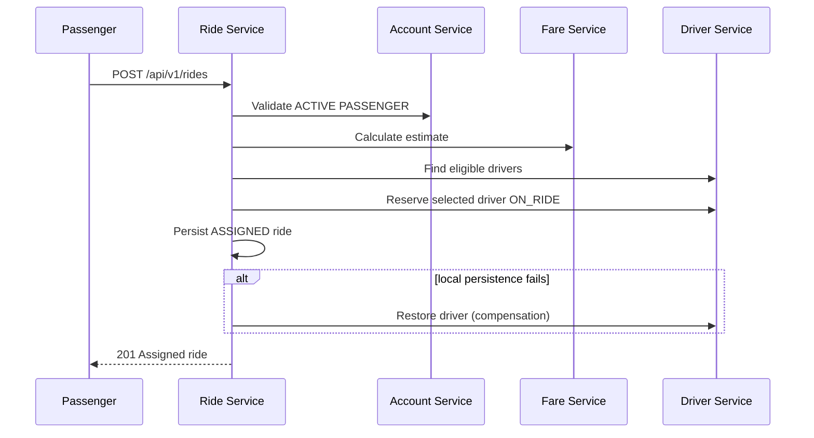
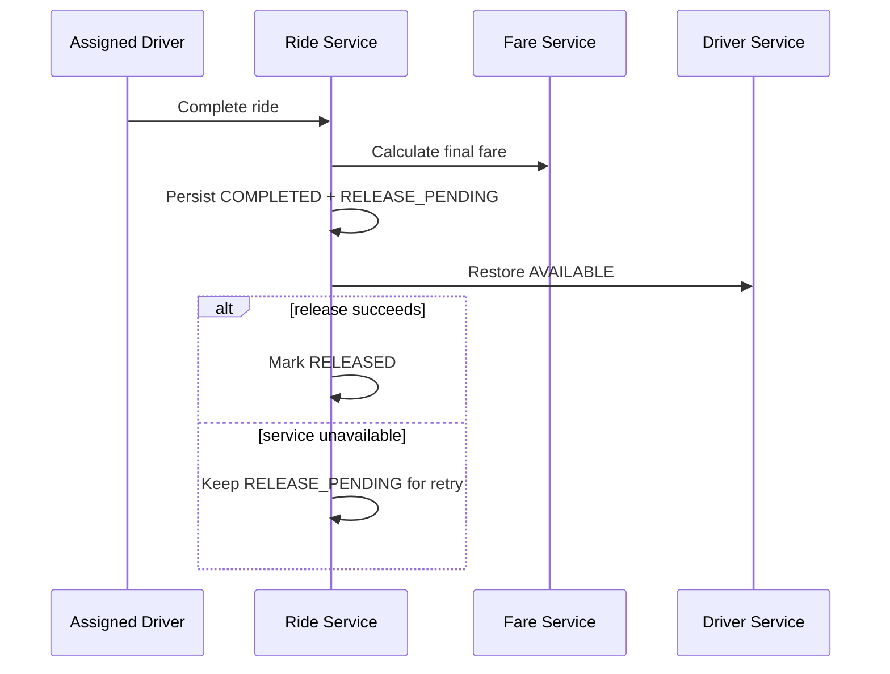

# Ride Lifecycle and Coordination

`COMPLETED` and `CANCELLED` are terminal. A passenger may cancel only `REQUESTED` or `ASSIGNED`. An assigned driver may cancel only `ACCEPTED`, before starting, and must give a reason.

## Request and assignment sequence

## Completion and release sequence

